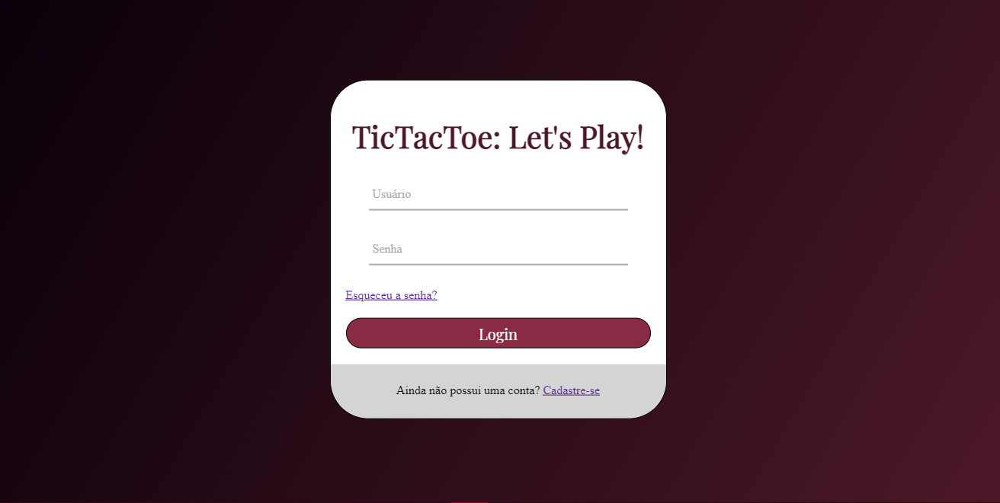
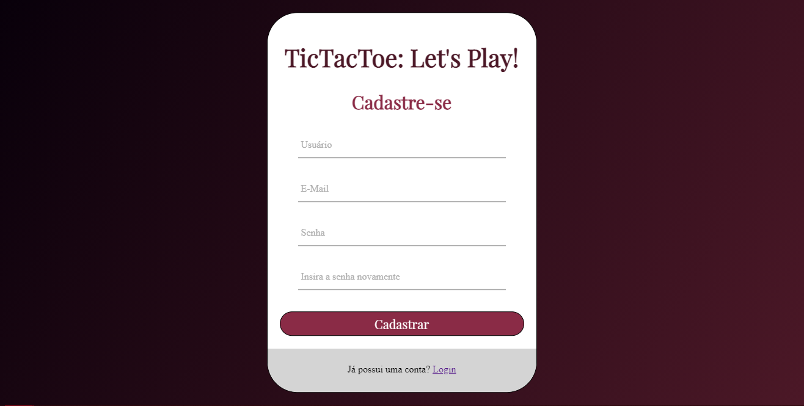

# Jogo da Velha Online

Esse treinamento Web que fiz para o projeto de estágio na Lyncas durante o segundo semestre de 2021.

- Designs próprios:

1. Tela de login
2. Tela de cadastro
3. Tela de um jogo de jogo da velha

- Telas cujo objetivo era copiar o modelo:

1. Listagem de usuários
2. "Sobre você"

- Fotos

1. _Tela de login_
   

2. _Tela de cadastro_
   

3. _Tela de jogo_
   (tba)

4. _Listagem de Usuários_
   (tba)

5. _Sobre você_
   (tba)
